# Especificação de Arquitetura: Plataforma de Ingestão Autônoma e Monitoramento de Autos (ANTT)

> Documento de arquitetura de solução — versão 1.1
> Público-alvo: diretoria de operações, TI corporativa e áreas de compliance/jurídico.

---

## 1. Visão Geral da Arquitetura

A plataforma foi concebida para eliminar a dependência de consulta manual ao portal da
ANTT, transformando um processo humano, intermitente e não auditável em um pipeline
autônomo, repetível e rastreável. A arquitetura se apoia em três princípios. **Resiliência:**
nenhuma indisponibilidade momentânea do portal público interrompe o ciclo — cada
documento não obtido é reprocessado automaticamente e, se ainda assim falhar, é
registrado como pendência explícita, jamais como ausência silenciosa; falhas de
infraestrutura (queda de sessão) são distinguidas de falhas do documento, de modo que um
problema de conexão nunca contamina o histórico dos autos. **Isolamento em camadas:**
captura, decisão, persistência e entrega são responsabilidades separadas, de modo que uma
mudança no portal do órgão afeta apenas a camada de ingestão, sem impacto sobre a base
consolidada nem sobre os consumidores da informação; da mesma forma, as unidades de
execução operam isoladas entre si, permitindo escalar o volume sem multiplicar o risco.
**Segurança da informação:** a solução opera exclusivamente com as credenciais já
pertencentes à empresa, respeita a validação de segurança exigida pelo órgão — que
permanece sob supervisão humana — e mantém todo o acervo documental e os dados
extraídos dentro do perímetro do cliente, sem trânsito por serviços de terceiros.

---

## 2. Diagrama de Arquitetura

```mermaid
flowchart LR
    subgraph L1["① Fonte de Dados"]
        direction TB
        Portal[Portal oficial da ANTT<br/>Vistas ao Processo]
        Publicados[(Autos e processos<br/>publicados por CNPJ)]
        Portal --> Publicados
    end

    subgraph L2["② Camada de Ingestão"]
        direction TB
        Sessao[Estabelecimento de sessão autenticada]
        Sessao --> Repres[Descoberta das empresas e filiais vinculadas]
        Repres --> Varredura[Varredura paginada do painel de consultas]
        Varredura --> Inventario[(Inventário de autos disponíveis)]
    end

    subgraph L3["③ Core Engine"]
        direction TB
        Reconcilia{Reconciliação<br/>com o acervo}
        Reconcilia -- Já capturado --> Descarta[Descarte controlado]
        Reconcilia -- Novo --> Fila[Fila de trabalho priorizada]
        Fila --> Captura[Unidades de captura isoladas<br/>execução paralela]
        Captura --> Politica{Política de<br/>retentativas}
        Politica -- Falha persistente --> Pendencia[Pendência sinalizada]
        Politica -- Sucesso --> Extracao[Extração estruturada do documento]
    end

    subgraph L4["④ Camada de Persistência"]
        direction TB
        Acervo[(Repositório documental<br/>autos originais)]
        Estado[(Registro de estado<br/>e checkpoint do ciclo)]
        Excecoes[(Registro de exceções)]
    end

    subgraph L5["⑤ Camada de Entrega"]
        direction TB
        Base[(Base consolidada de autos)]
        Relatorio[/Relatório do ciclo:<br/>novos, ignorados e pendências/]
        Consumo[Prazos, defesas,<br/>indicadores e BI]
        Base --> Relatorio --> Consumo
    end

    Publicados --> Sessao
    Inventario --> Reconcilia
    Descarta --> Estado
    Extracao --> Acervo
    Pendencia --> Excecoes
    Captura --> Estado
    Acervo --> Base
    Estado --> Reconcilia
    Excecoes --> Relatorio
```

**Leitura do diagrama.** O fluxo é unidirecional da fonte pública para a entrega, com um
único laço de realimentação: o registro de estado (④) alimenta a reconciliação (③),
e é ele que garante que cada ciclo comece exatamente de onde o anterior parou.

---

## 3. Mapeamento Logístico e Jornada Visual

Cada módulo abaixo corresponde a uma etapa observável do ciclo, ilustrada com a tela real
do portal da ANTT em que a plataforma atua.

### Módulo 01: Autenticação e Entrada no Portal

**Objetivo.** Estabelecer uma sessão legítima no portal da ANTT com as credenciais da
própria empresa, cumprindo integralmente a validação de segurança exigida pelo órgão.

**O que acontece.** A plataforma abre o canal oficial de acesso — o SIFAMA, Área do
Autuado — apresenta as credenciais corporativas e submete a verificação de segurança à
supervisão humana, passo mantido deliberadamente sob controle de uma pessoa por decisão
de conformidade. Confirmada a autenticação, a sessão é propagada às unidades de captura,
que passam a operar sob o mesmo contexto autorizado, sem novas solicitações de credencial.

**Controles.** Nenhuma credencial trafega para fora do ambiente do cliente. A validade da
sessão é verificada antes de cada bloco de trabalho: se o portal encerrar a sessão, o ciclo
é interrompido com aviso explícito, em vez de produzir resultado incompleto.

*Print 01 — Porta de entrada oficial: autenticação por CPF/CNPJ e senha, com verificação
antirrobô resolvida por uma pessoa.*

---

### Módulo 02: Varredura e Painel de Consultas Multi-CNPJ

**Objetivo.** Obter a relação completa e atual dos processos de **todas** as empresas e
filiais vinculadas ao acesso, sem depender de listas paralelas.

**O que acontece.** A plataforma descobre dinamicamente o conjunto de representados
disponíveis no acesso — matriz e filiais — e consulta os processos de cada um deles sem
qualquer filtro restritivo, percorrendo a listagem de resultados página a página até a
última. O portal é tratado como fonte da verdade: o inventário de autos nasce da consulta
oficial, e não de uma base interna que possa estar desatualizada.

**Controles.** A cobertura é explicitada no registro de execução por CNPJ e por página, o
que permite auditar se alguma unidade ficou de fora. O fim de cada listagem é determinado
pelo próprio conteúdo retornado, e não por rótulos da interface.

*Print 02 — Painel de consulta: a plataforma percorre todos os representados do seletor,
sem restringir por tipo de fiscalização, para não perder nenhum processo.*

---

### Módulo 03: Captura, Validação e Download do Auto

**Objetivo.** Trazer para o acervo apenas o que é efetivamente novo, com garantia de
integridade do documento recebido.

**O que acontece.** Antes de qualquer captura, cada auto do inventário é confrontado com o
acervo existente — documentos já arquivados e base consolidada. O que já foi obtido é
descartado de forma controlada; o que é novo entra em uma fila de trabalho priorizada e é
processado por unidades de captura isoladas, executando em paralelo. Cada documento
recuperado é validado antes de ser incorporado ao repositório; falhas momentâneas do
portal acionam a política de retentativas descrita na seção 4.

**Controles.** Nenhum documento é sobrescrito e cada auto é identificado de forma unívoca,
o que torna a operação idempotente — reexecutar o ciclo não gera duplicidade nem perda.

*Print 03 — Captura em andamento: a partir da listagem, cada auto pendente é solicitado ao
portal e recebido em formato digital.*

---

### Módulo 04: Estruturação e Entrega dos Resultados

**Objetivo.** Converter documentos em informação acionável, sem digitação manual.

**O que acontece.** Cada documento novo passa por leitura estruturada, que localiza e extrai
os campos relevantes do auto — identificação, data da infração, veículo, características do
transporte, enquadramento legal e descrição da infração. Os registros são consolidados em
uma base única, incremental: os autos já processados em ciclos anteriores são preservados
e apenas os novos são acrescentados. Ao final, o ciclo emite um relatório com o que foi
capturado, o que foi ignorado por já constar no acervo e o que ficou pendente.

**Controles.** A base consolidada e o repositório documental são reconciliados a cada ciclo
— divergência entre a contagem de documentos e a de registros é um sinal de alerta
imediato.

*Print 04 — Entrega final: uma linha por auto, com os campos já extraídos do documento
oficial e prontos para análise de prazos, defesas e indicadores.*

---

## 4. Pilares de Governança e Qualidade

### 4.1 Política de Zero Duplicidade

| Aspecto | Definição |
|---|---|
| **Princípio** | Um auto de infração é capturado uma única vez, independentemente de quantas vezes o ciclo seja executado. |
| **Mecanismo** | Dupla verificação antes de cada captura: presença do documento no repositório **e** presença do registro na base consolidada. Basta uma das duas evidências para que o auto seja considerado já lido. |
| **Efeito operacional** | Execuções podem ser disparadas quantas vezes forem necessárias — diariamente, sob demanda ou após uma interrupção — sem risco de retrabalho, inflar a base ou sobrecarregar o portal público. |
| **Evidência** | O relatório do ciclo informa, por CNPJ, quantos autos foram ignorados por já constarem no acervo. |

### 4.2 Resiliência a Falhas (Política de Retentativas)

| Aspecto | Definição |
|---|---|
| **Princípio** | Indisponibilidade do portal é tratada como evento esperado, não como exceção fatal. |
| **Mecanismo** | Falha na obtenção de um documento devolve o item à fila para nova tentativa automática dentro do mesmo ciclo. Esgotado o limite de tentativas, o auto é promovido a pendência formal e registrado no log de exceções, com contagem acumulada entre execuções. |
| **Falha de infraestrutura** | Queda de sessão ou indisponibilidade do portal devolve a tarefa à fila **sem** consumir tentativa do auto, e interrompe o ciclo com diagnóstico claro — o histórico de um documento nunca é penalizado por um problema de conexão. |
| **Efeito operacional** | A falha nunca se manifesta como ausência silenciosa: ou o documento entra no acervo, ou aparece nominalmente na lista de pendências para conferência humana. |
| **Limite de proteção** | Autos que falham de forma reincidente ao longo de múltiplos ciclos deixam de ser tentados automaticamente e passam a exigir tratamento manual, evitando desperdício de janela operacional. |

### 4.3 Checkpoint e Continuidade

| Aspecto | Definição |
|---|---|
| **Princípio** | O progresso é durável: nenhuma interrupção obriga a recomeçar do zero. |
| **Mecanismo** | O estado do ciclo é persistido continuamente — autos concluídos, tentativas consumidas e exceções registradas. Cada nova execução reconstrói o ponto de retomada a partir desse registro somado ao acervo real em disco. O inventário levantado na varredura é gravado assim que fica pronto, de modo que o resultado do levantamento sobrevive a qualquer falha posterior. |
| **Efeito operacional** | Queda de rede, encerramento da sessão ou parada programada não geram perda de trabalho nem duplicidade na retomada. |
| **Auditoria** | O registro de estado constitui a trilha do que a plataforma sabia e fez em cada ciclo, disponível para inspeção. |

**Status de homologação.** O pipeline foi validado ponta a ponta em execução de referência:
162 autos identificados como novos, **162 documentos capturados sem falha**, 162 registros
extraídos sem erro e reconciliação exata entre repositório e base consolidada (7.333
documentos / 7.333 registros). A varredura multi-CNPJ com paginação completa foi
homologada em seguida — **20 CNPJs, 123 páginas e 5.612 processos inspecionados**, com
442 autos novos identificados. A captura em massa desse volume está agendada para o
próximo ciclo.

---

## 5. Matriz de Evolução Operacional

| Dimensão | Cenário Legado (Manual) | Arquitetura Automatizada |
|---|---|---|
| **Cobertura** | Consulta CNPJ a CNPJ, limitada ao tempo disponível do operador; filiais menores frequentemente preteridas. | Varredura integral de todas as empresas e filiais vinculadas, em todas as páginas de resultado, a cada ciclo. |
| **Frequência** | Esporádica, dependente de disponibilidade de pessoal. | Recorrente e repetível, com custo marginal próximo de zero por execução. |
| **Risco de prazo** | Auto pode ser descoberto após o vencimento do prazo de defesa. | Detecção sistemática do que é publicado, com relatório por ciclo. |
| **Duplicidade e retrabalho** | Reconsulta do mesmo processo por falta de controle centralizado. | Zero duplicidade por verificação dupla obrigatória antes de cada captura. |
| **Tratamento de falhas** | Falha passa despercebida; o auto simplesmente não aparece. | Retentativa automática e, no limite, pendência nominal para conferência. |
| **Estruturação dos dados** | Digitação manual campo a campo, sujeita a erro. | Extração estruturada automática, consolidada em base única. |
| **Continuidade** | Interrupção implica recomeço e reconferência. | Checkpoint durável: o ciclo retoma exatamente do ponto anterior. |
| **Auditabilidade** | Sem rastro do que foi conferido, por quem e quando. | Trilha completa por ciclo: capturados, ignorados e pendentes. |
| **Escalabilidade** | Cresce linearmente com número de filiais e volume de autos. | Absorve novas filiais e volume sem alteração de processo. |

---

*As telas apresentadas na seção 3 foram capturadas no ambiente real de operação. A versão
em página única (`arquitetura_solucao_antt.html`) traz as mesmas imagens embutidas no
próprio arquivo, dispensando a pasta `prints/` ao ser compartilhada.*
